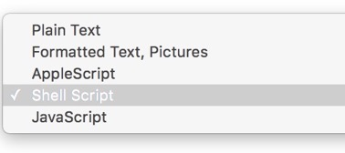
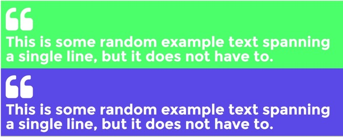
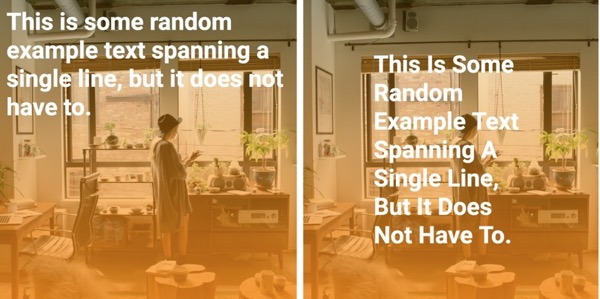
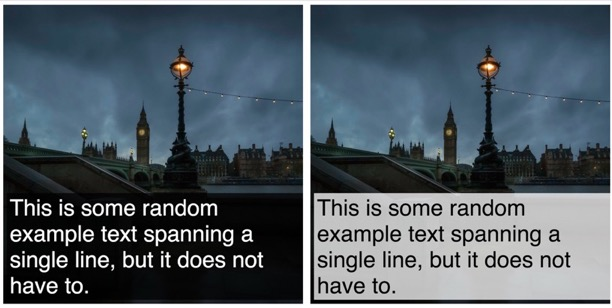
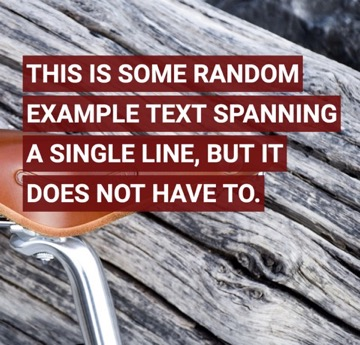
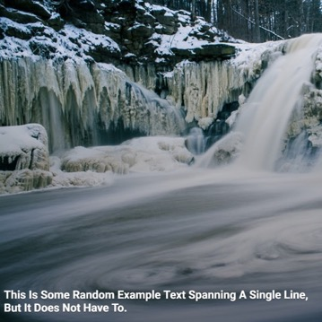
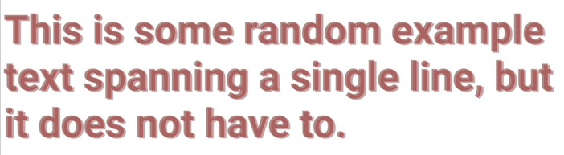
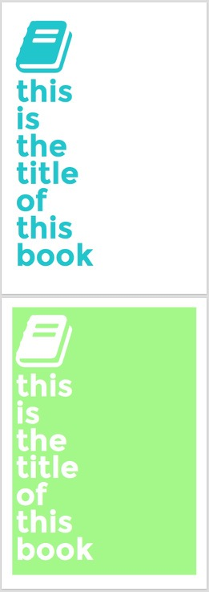

# README
## TextExpander Snippets for creating HTML/CSS Wallpapers

### How to use:

* Open any HTML-Wallpaper???.txt file from this folder in a text editor.
* On your Mac computer, create a TextExpander snippet and copy-paste the code from the above file into it.
* Remember to save the snippet as a 'Shell Script'  

* Just run the script, and the browser should open with thus created wallpaper.
* You will see the word `%clipboard` in these snippets. It's the inbuilt Clipboard variable used by TextExpander.
* NOTE: All the images are generated randomly at the runtime of the snippet. Images courtesy: [Unsplash.com](https://unsplash.com/?grid=multi)

----------

### Here's how the generated wallpapers look like:

#### HTML Wallpaper 1:

#### HTML Wallpaper 2:

#### HTML Wallpaper 3 + A4 Book Cover:

#### HTML Wallpaper 4:

#### HTML Wallpaper 5:

#### HTML Wallpaper 6:

#### HTML Wallpaper 7:

#### HTML Wallpaper 8 + A4 Book Cover:

#### HTML Wallpaper 0 Multiline Quote Boxes with Square Pdf Print:   
[Sample text file for clipboard here](sample-and-output-files/sample-quotes-text-for-multiline-wallpaper0.txt) | [Wallpaper HTML output here](sample-and-output-files/quotes_TMP-wallpaper-wm0.html)

#### HTML Wallpaper CD Covers 1 + PDF Print:

#### Html Wallpaper Full HD 1 with PDF Print:     
[Collage List of Poly backgrounds used in this are here](showcase-images/screenshot-wallpaper-fullHD1-backgrounds.jpg)    

